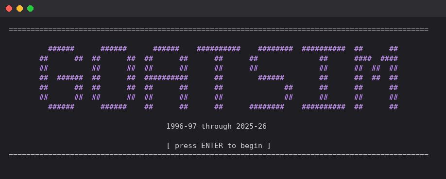
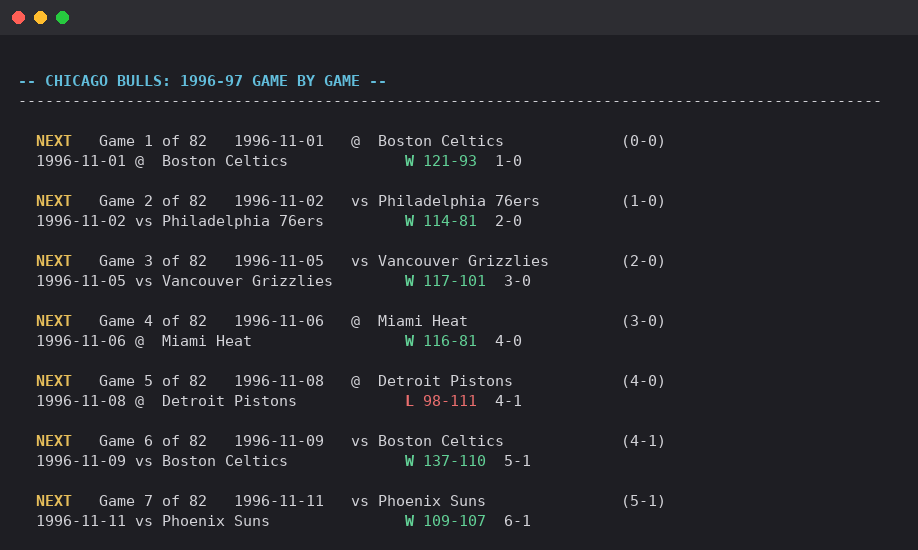
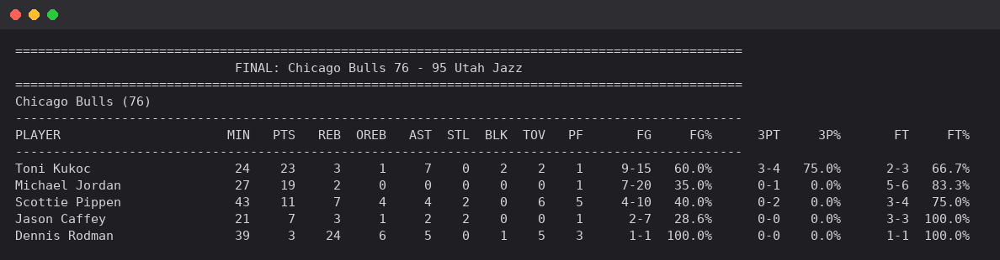

# NBA Box-Score Simulator

Replay any real NBA season from 1996-97 through 2025-26 — same real
rosters, same real schedule, same real injuries and trades — and watch
it play out differently. Every simulated game produces a full,
internally-consistent box score for every player, built from that
player's real season tendencies, with each team's own real defense
genuinely affecting how their opponents shoot.

It's not a possession-by-possession sim — no shot clock, no play-by-play.
It's a **box-score generator**: pick a season, pick a team, and watch it
unfold one game at a time, exactly the way a real season report reads.



## What's actually playable right now

- **History Sim** — pick any single season, or a run across several,
  follow one franchise through real trades/injuries/renames, and watch
  it play out game by game, round by round, into a full simulated
  postseason.
- **Game Sim** — one exhibition game between any two teams, even across
  two different real seasons (the 1996-97 Bulls against the 2025-26
  Thunder, blending both eras' real numbers).

Two more modes (Legacy Sim — play out one real player's whole career —
and a fourth, undecided one) are stubbed into the menu but not built
yet. They're shown on purpose, not hidden, so the roadmap is visible.

## Watch it happen, not just the final score

Every season paces one game at a time — next opponent, current record,
your call to sim it, skip to the trade deadline, or jump to the end —
with a full box score available for any game, any series, even the
play-in, whether or not it's your own team's.





## It's actually accurate, not just plausible

Every tunable constant in the simulation was fit against real data, not
guessed — and then checked against **every one of the 30 real seasons
this project can play**, not just tuned on one and hoped it generalized.

- **Standings**: 5.31 games mean absolute error on a single simulated
  run, 0.88 correlation against real final standings, across all 30
  seasons (892 team-seasons). For comparison, just guessing the
  league-average win total for every team gets you 10.11 — so the
  model is doing real work, not coasting on the schedule alone.
- **That 5.31 actually undersells the model, and here's the honest
  math**: averaging 30 independent simulated runs of the same real
  season (which cancels out pure randomness) brings the error down to
  4.27 — that's the model's real, systematic accuracy. The rest of the
  5.31 (about 3 games' worth) is just the ordinary noise of reporting
  one random draw instead of an average, not the model being wrong.
  Both numbers are real: 4.27 is the fairer one for judging the model
  itself, 5.31 is the honest number for what any single run actually
  looks like.
- **How close to the ceiling that is**: two independent simulated runs
  of the *same* real season already differ from each other by ~4.4
  wins of pure randomness — that's not model error, that's basketball.
  Add the luck already baked into one real 82-game season and the
  irreducible floor is ~4.7.
- **Season awards** (MVP, ROY, DPOY, MIP, Coach of the Year) are each a
  real scoring formula, backtested with a train/holdout split against
  every actual winner nba_api can confirm, not eyeballed.
- **Real mechanics**, not shortcuts: real injuries (every real absence,
  anchored to when it actually started), real in-season trades (a
  traded player is simulated on both real teams, for the real games
  each one actually played), real overtime, real era-correct playoff
  formats (best-of-5 first rounds before 2003, no play-in before
  2019-20, the real one-off 2019-20 bubble format).

**One honest caveat, found by a reader, not by me.** The 30-season
train/holdout split (seasons through 2015-16 for tuning, 2016-17
onward held back to test) held up well the *first* time it was
checked — picking constants based on training data alone cost only
about 0.2 games against the best possible holdout setting, out of a
3.16-game spread across the 149 settings actually tried. But that same
holdout got re-checked across 8 successive tuning passes as the
project evolved, and a holdout you keep looking at and reacting to
stops being a clean, never-seen test after the first look. The current
5.31 is honestly closer to a validation number by this point than a
claim about brand-new unseen data. Credit to Reddit's **u/Bright_Mix_773**
for reading the raw files in `benchmarks/` and `sweeps/` and catching
this instead of taking this README's word for it — exactly the kind of
feedback this project was posted to get.

The full write-up of what was tuned, what was measured, and what's
still an open, honestly-labeled gap is in [CLAUDE.md](CLAUDE.md) — it's
the project's own running lab notebook, kept in the repo instead of
thrown away.

## Quickstart

Requires Python 3.9+.

```bash
git clone https://github.com/jesuscervantes070-sudo/nba-box-score-sim.git
cd nba-box-score-sim
pip install -r requirements.txt   # nba_api, numpy
python data_source.py             # fetches + caches the 2025-26 season (~1-2 min)
python main.py
```

Want more than the current season? Fetch any of the other 29 real
seasons this project supports:

```bash
python data_source.py --season 2015-16
```

`main.py` will list every season you've fetched and let you pick.

## Status

This is a solo hobby project, actively worked on. History Sim and Game
Sim are solid and worth trying; the other two menu entries are not
built yet. **Bug reports and feedback are genuinely wanted** — this is
exactly the stage where they're most useful. Open an issue, or just
say what felt off.

## Why this exists

Three reasons, honestly:

1. **The actual basketball question**: if you replay history with the
   same players and the same real tendencies, but let the games
   themselves play out fresh, how differently does it actually go —
   and how close can a from-scratch simulation get to what really
   happened, using nothing but publicly available box-score-level
   stats?
2. **A design sketch for a project I want to eventually build myself.**
   I'm learning Python from scratch, not from a CS background. This is
   partly a map of where I want this idea to go, and partly a
   from-scratch reference to build against once I know enough to write
   it myself.
3. **A check on where AI-assisted coding actually is right now.**
   Every line here was written working with Claude (Anthropic's
   Claude Code) — I drove every design decision, picked what to build
   next, tested it, and caught real bugs by actually playing it, but
   didn't write the implementation by hand. I expected that to take
   months for something this deep (real injuries, real trades, a
   backtested accuracy pipeline across 30 seasons, season awards with
   real ground truth). It took about 3-4 days. That gap between
   expectation and reality was worth sharing on its own.
